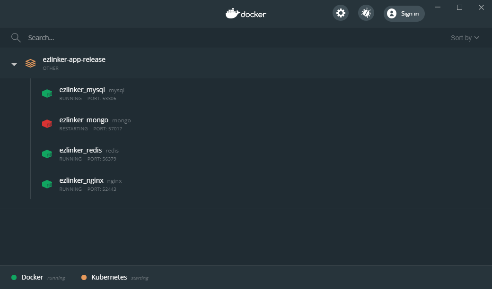
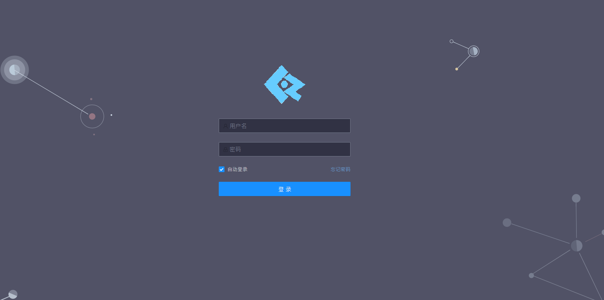
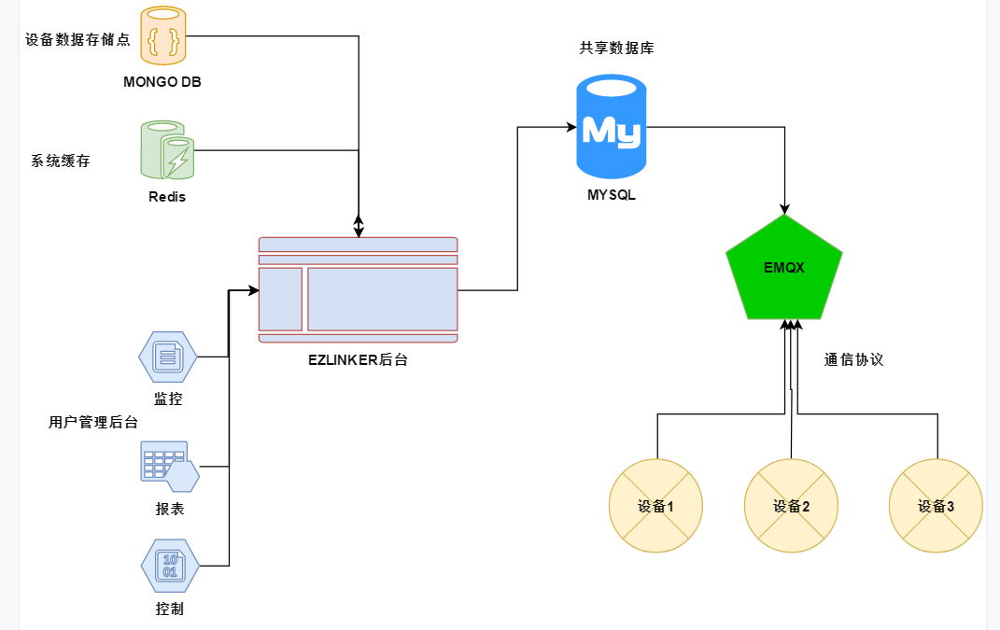

[[toc]]

## 1 环境准备
### 1.1 操作系统
当前的版本在Linux系列UbuntuServer1804和Centeros7上面测试通过，其他操作系统有待大家测试。
如果是windows下，Winwods10测试通过，建议用DockerDesktop来构建，建议安装最新版的DockerDesktop。
### 1.2 Docker引擎 
为了方便大家安装环境，这边整理一下相关资料的位置，但是不贴具体步骤，按照文档走即可：
- DockerDesktop下载地址：https://www.docker.com/products/docker-desktop
- Linux安装文档：https://docs.docker.com/engine/install/
- Docker图形化WEB管理界面: https://www.portainer.io/
## 2.快速构建
### 2.1 Compose构建
为了方便大家构建，我们专门写了个compose文件：https://github.com/wwhai/ezlinker/blob/master/resources/docker/ezlinker-app-release/docker-compose.yml，只需要下载该文件，按照文档操作来做：https://docs.docker.com/compose/，即可构建一个DockerStack。
命令如下：
```
mkdir ezlinker
cd ezlinker
wget https://github.com/wwhai/ezlinker/blob/master/resources/docker/ezlinker-app-release/docker-compose.yml
docker-compose up -d
```


::: warning
这里比较慢(我大概构建了有10分钟。。。。可能我的网络差到极点了)，跟网络有关，因为要下载大量文件，所以耐心等待完成。
:::

输出：
```
docker-compose up -d
Creating network "ezlinker-app-release_ezlinker_net" with driver "bridge"
Creating ezlinker_mysql ... done
Creating ezlinker_redis ... done
Creating ezlinker_mongo ... done
Creating ezlinker_nginx ... done

```
### 2.2 检查构建情况
如果构建成功以后，在你的Docker面板上会看到一个DockerStack应用：

如果面板上显示的Docker容器全部是绿色状态，说明启动正常，图上我本地端口和Docker冲突了，所以MongoDb没有启动起来。大家遇到这种情况先检查一下本地的环境或者端口是否冲突。

## 3. 运行体验
以上步骤没问题，直接打开:http://[IP]:22500/,即可看到登陆界面:

默认的登陆用户：ezlinker，密码：password。
## 4. 产品理念
### 4.1 设计思路
EZLinker针对企业用户开发,私有化部署场景下运营,针对中小企业在物联网项目下的技术开发耗时耗力或者技术短板的痛点,推出一个一体化,简单化,轻量级的解决方案.产品的用户群体为企业用户,或者个人用户,作用领域为物联网项目开发,管理,运营层面.本产品以开源协议的形式发布,推崇商业友好的ApacheV2开源协议,所有贡献者共享代码版权.
### 4.2 系统架构
下图是系统最精简的架构案例：

