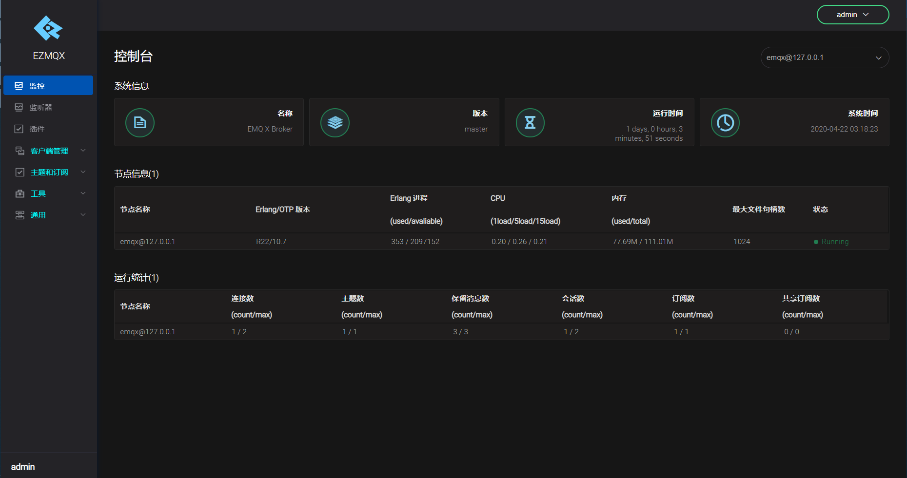
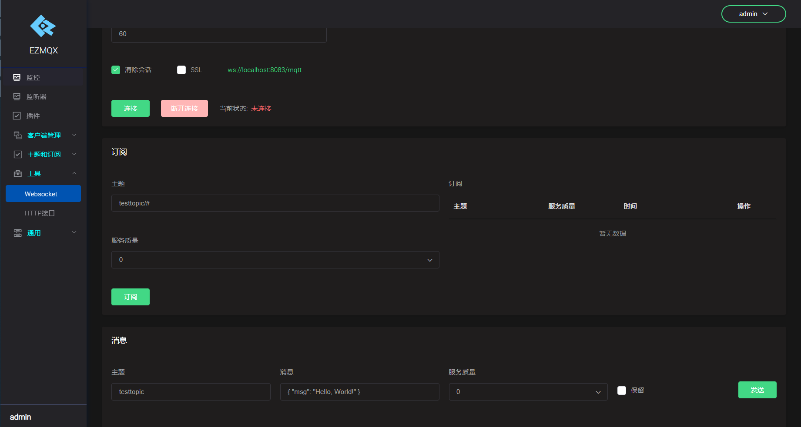
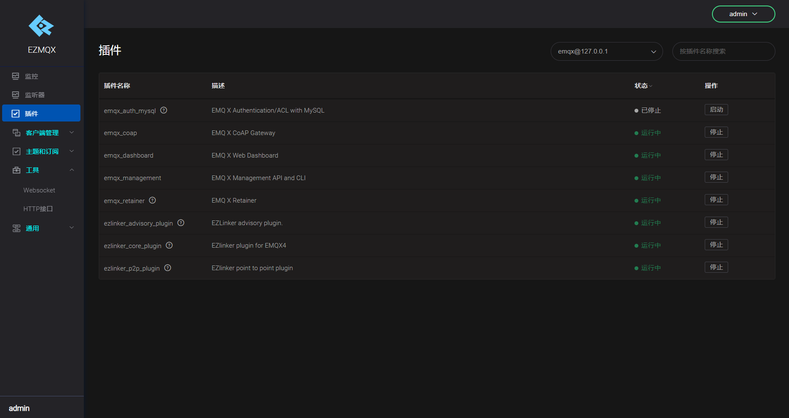

[[TOC]]
## 1 EZMQX简介
本项目是EMQX开源版本的Fork社区发行版，内核完全基于EMQX4.0，在此之上封装了常见的一些应用层开发插件。再次感谢EMQX团队的不懈努力，前人栽树后人乘凉，为我们社区提供优秀产品。

## 2 下载安装
针对不同的操作系统和版本，我们也提供了安装包，下载地址：
- https://gitee.com/wwhai/emqx-rel/attach_files
## 3 编译安装
```shell
git clone  https://gitee.com/wwhai/emqx.git emqx-rel
cd emqx-rel && make
./_build/emqx/rel/emqx/bin/emqx console
```
## 4 特色功能
EMQX开源版不支持的一些功能我们进行了重新开发，最后开放出来供给社区使用。
1. 数据持久化到MongoDB；
2. WEB事件通知接口；
3. Mysql8认证支持；
4. 集成到常见编程语言的系统的驱动支持，目前已经移植了Java的库；
5. 原生UDP、TCP协议支持，简单的私有化协议，简化嵌入式开发；
6. 标准COAP协议支持；
7. 实际项目总结经验和一些架构设计思路；
8. HTTP回调接口，用来监控设备上下线状况；
9. P2P（点对点）通信，在不用订阅的情况下直接发送消息；
10. EKKA集群方式改为EPMD;
11. 删除多余插件，精简化EMQX.
## 5 界面预览
1. 控制台首页，去除了冗余内容

2. WebSocket测试工具

3. 新增自定义私有HTTP、UDP协议

