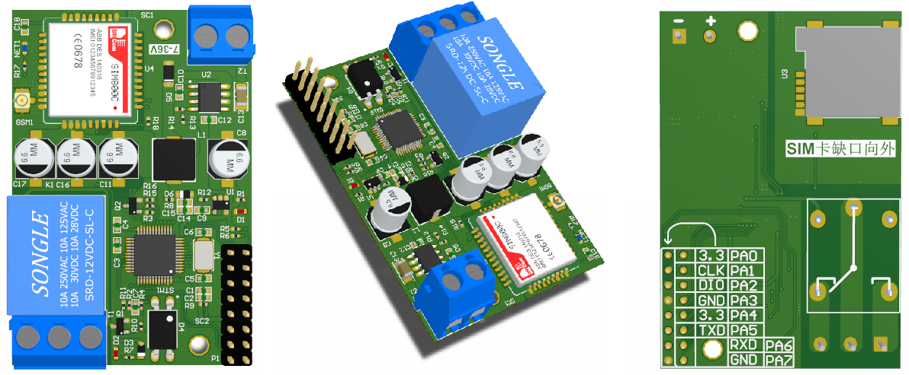
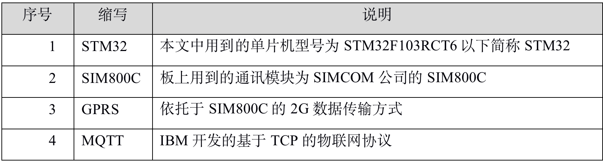
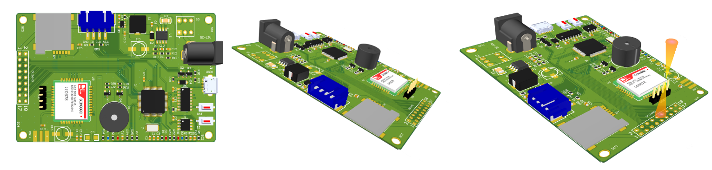
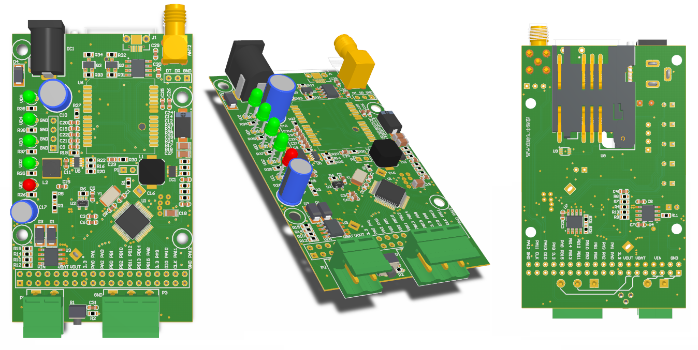

## 介绍
::: warning
注意：本页所有源码，原理图均是实际生产环境下的项目，大家可放心使用。另外我们团队目前有做方案为主，不单个销售硬件，有批量需求可联系我们。
:::
[[toc]]
## 1. STM32-Relay-sim800-GPRS-继电器


### 1.1 简介

该开发版是我们公司实际生产环境下实用的一款远程继电器，目前作用在某农业项目，主要用在开关场景下。为了回馈社区，特将其开源，供给网友们学习研究。该开发板用于学习和产品前期评估，不可用于非法或者医疗军事等领域，造成的后果一律由用户自行承担。本文档可能会有不详细的部分，或者错误的部分，有疑问可通过及时通讯软件与我方联系，谢谢。
### 1.2 参数
开发版参数如下表所示：


底板是STM32和SIM800C集成在一起的一个板子，板子供电为5V-12V DC，推荐使用12V/2A的适配器，如果使用劣质的适配器，可能导致GPRS模块工作不稳定，或注册网络失败等问题，电压过高可能导致板子上器件的烧毁。本板出售时不配带电源适配器，需要自行准备。
板子上有STM32F103RCT6单片机，FLASH容量256KB，RAM容量64KB，用户可以自己开发；板子上有LM75温度传感器，接口为IIC，提供例程，用户也可以自行开发温度上传程序等等，板子上SIM800C GPRS模块，用户可以用该模块来打电话，发送或接收短信，该模块支持TCP、UDP、HTTP、MQTT等网络协议，用户可以二次开发。
### 1.3 烧录
板子上使用的串口芯片为国产的CH340，可以通过百度进行下载也可以通过驱动人生等软件进行自动安装，如果存在问题，请联系技术支持获得软件包或者远程协助。

板子的左侧4PIN白色端子为SWD烧录接口，可以接STlink或者Jlink，板子上的USB转串口接在单片机的UART1上，暂时只能传输串口数据，不可进行串口烧录。
### 1.4 固件程序
固件程序我们也一并做了开源，地址：https://github.com/wwhai/STM32-MQTT ,只需要更改你的MQTT服务器配置即可：
```c

/* 需要在这里更改服务器地址端口，用户名密码等信息 */
/* 设备默认会将IMEI(SIM800C模块上的标号)设置为clientID */
/*  */
#define MQTT_SERVER_IP  "localhost" 
#define MQTT_SERVER_PORT	"1883"

char client_id[128] = {0};
char user_name[128] = {"username"};
char password[128] = {"password"};
char topic[64] = {"/sw1"};
```
## 2. STM32-OV2640-sim800-GPRS-图传


### 2.1 简介
底板是STM32和SIM800C集成在一起的一个板子，摄像头是以个以OV2640的CMOS模组，摄像头的有20PIN和18PIN两种，无论是哪种，请将摄像头和板子上的插座左对齐，然后插入。
板子供电为5V-12V DC，推荐使用12V/2A的适配器，如果使用劣质的适配器，可能导致GPRS模块工作不稳定，或注册网络失败等问题，电压过高可能导致板子上器件的烧毁。本板出售时不配带电源适配器，需要自行准备。
板子上有STM32F103RCT6单片机，FLASH容量256KB，RAM容量64KB，用户可以自己开发；板子上有LM75温度传感器，接口为IIC，提供例程，用户也可以自行开发温度上传程序等等，板子上有SIM800C GPRS模块，用户可以用该模块来打电话，发送或接收短信，该模块支持TCP、UDP、HTTP、MQTT等网络协议，用户可以二次开发。配带的OV2640摄像头可以输出JPEG、YUV、RGB等格式的图像数据，摄像头接口兼容原子的18引脚的OV2640摄像头模块。用户可以将配带的摄像头用在其他板子上。


### 2.2 烧录
板子上使用的串口芯片为国产的CH340，可以通过百度进行下载也可以通过驱动人生等软件进行自动安装，如果存在问题，请联系技术支持获得软件包或者远程协助。

板子的左侧4PIN白色端子为SWD烧录接口，可以接STlink或者Jlink，板子上的USB转串口接在单片机的UART1上，暂时只能传输串口数据，不可进行串口烧录。
### 2.3 固件程序
固件程序我们也一并做了开源，地址：https://github.com/wwhai/STM32_GPRS_CAMERA
## 3. 战旗-MINI-V2-开发板


### 3.1 简述
战旗MINI开发板是一种产品级的STM32 NB/GPRS开发板/评估板，现已应用在多种产品之中，提供了多种电源接口。
### 3.2 参数
1.通信模组：M5310A（NB）/M5313（GPRS/NB双模）
2.主控芯片：STM32F103C8T6
5.最大功率10W
6.供电：主电源：12V-36V  备用电源：5V  锂电池：3.7V
### 3.3 产品特色
1. 外形与开孔：与市场上DTU外壳的开矿和板框尺寸一致，可直接安装在DTU外壳中。方便用户直接从开发板变成产品
2. 宽电压输入：主电源支持12V-36V电源输入，方便对接不同的系统
3. 多电源接口设计：分三个电源接口。主电源，次电源，备用电池
4. 抽屉式卡槽设计：采用坚固的高温SIM抽屉式卡槽，方便用户更换SIM卡
5. 铁电存储器：采用铁电存储器，可以无限制的刷写EEPROM
6. 无缝切换电源：多种电源同时供电，插板其中某一种电源时无缝切换不掉电
7. 可配置接线柱：提供了一个KF2EDG5.08-2P和KF2EDG5.08-3P的接线柱。引出了对应的排针接口，用户可通过线缆和短路帽连接对应的接线柱
8. 电池充放电管理（选配）：可以对锂电池进行充电
9. 断线报警（选配）：搭载5F法拉电容，可以实现断电的瞬间发送报警数据